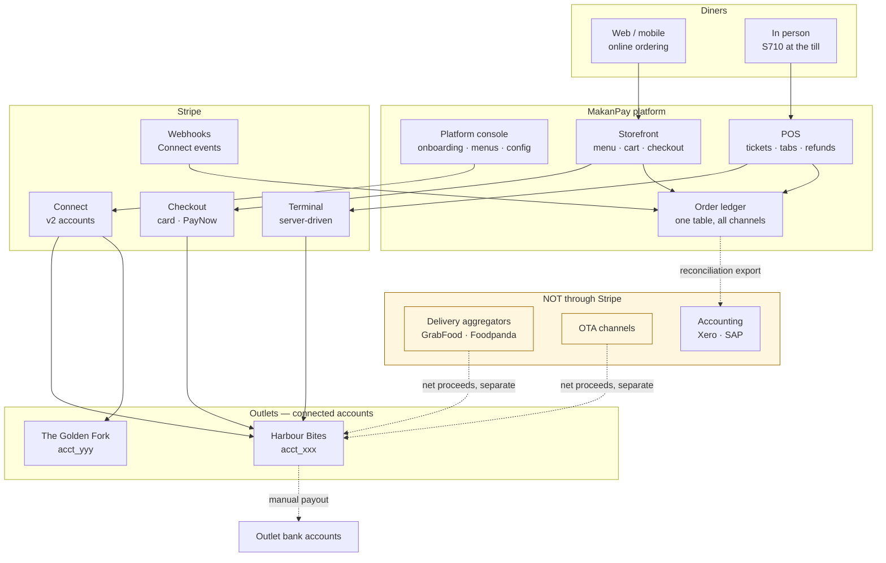
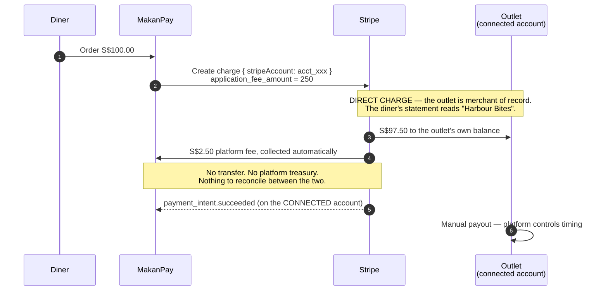
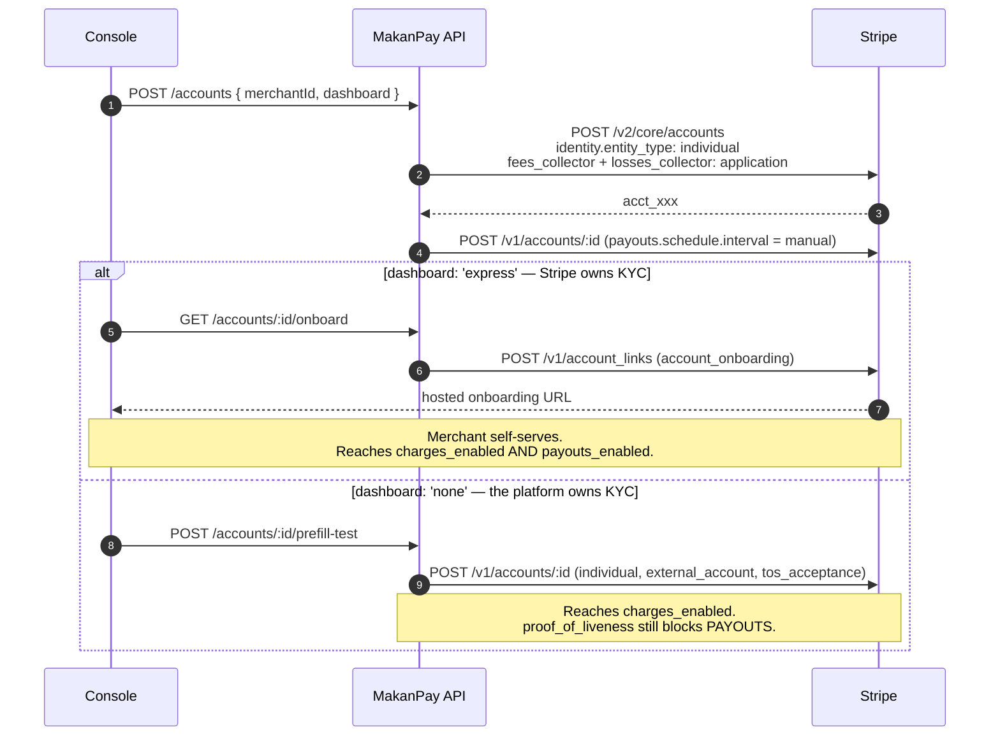
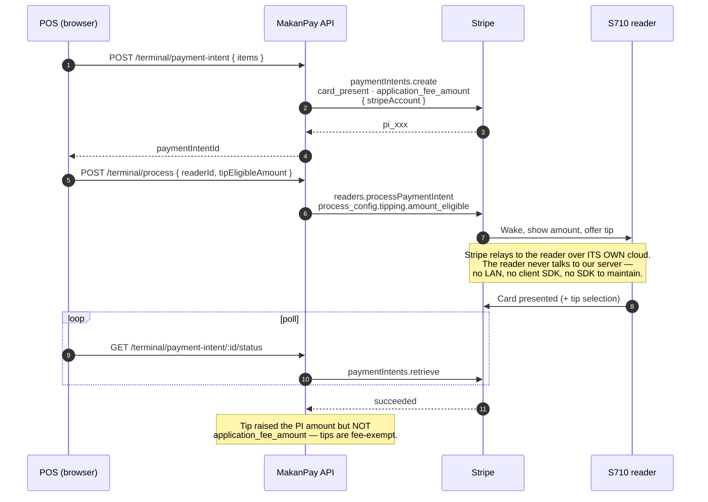
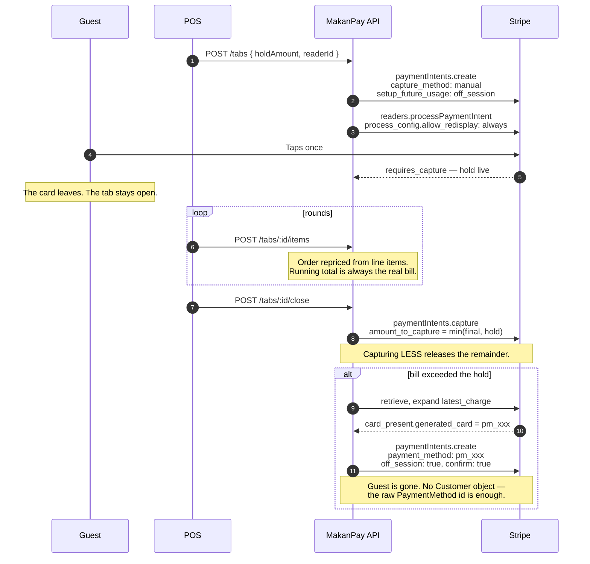

# MakanPay — Reference Architecture

Three levels, following the lab's own convention: L100 landscape, L200 fund flow,
L300 sequence detail.

---

## L100 — Platform landscape

Where Stripe sits, and — as importantly — where it does not.



**The boundary that matters.** Aggregator and OTA revenue reaches the outlet
without passing through Stripe. Those orders have no PaymentIntent and no platform
fee. Assuming otherwise is the most common scoping error in an F&B engagement, so
the ledger records them as their own channel and reconciliation shows them
explicitly as *not* flowing through Stripe.

---

## L200 — Fund flow (direct charges)



Refunds reverse the same way: `refund_application_fee: true` returns the platform's
S$2.50 alongside the outlet's S$97.50. There is no transfer to reverse, so
`reverse_transfer` plays no part.

---

## L300a — Connected account creation, both onboarding modes



**Why `entity_type: 'individual'`.** A Singapore *company* account triggers full KYB
— ACRA Bizfile, UEN verification, UBO proof, company-authorization documents — none
of which test mode relaxes. `individual` needs data fields only, no uploads.

---

## L300b — Terminal, server-driven



---

## L300c — Running tab, hold → grow → settle



---

## L300d — Webhook reconciliation

```mermaid
sequenceDiagram
  autonumber
  participant S as Stripe
  participant W as POST /webhooks
  participant DB as Ledger

  S->>W: event (raw body)
  W->>W: constructEvent — verify Stripe-Signature
  W-->>S: 200 immediately
  Note over W,S: ACK first. Stripe retries anything slow<br/>or non-2xx; our handlers are local writes.
  W->>DB: seen event.id before?
  alt duplicate
    Note over W: Suppressed. Plus state-level guards —<br/>a replay cannot double-post a paid order.
  else new
    W->>W: resolve outlet from event.account
    W->>DB: apply handler
  end
```

**Connect routing.** Direct-charge events fire on the **connected** account, so
`event.account` identifies the outlet. Locally this requires
`stripe listen --forward-connect-to`. Plain `--forward-to` sees only platform
events and would show nothing at all for this build.

---

## Component map

| Path | Responsibility |
|---|---|
| `server/config.js` | Env-driven config; refuses to boot on a live key |
| `server/db.js` | SQLite schema, migrations, seed |
| `server/lib/stripe.js` | Client, `onAccount()` scoping, idempotency keys, error surfacing |
| `server/lib/money.js` | SG bill composition, tip-exempt fee calculation |
| `server/lib/terminal.js` | `ensureLocation`, reader cache |
| `server/lib/testdata.js` | SG test-mode KYC values |
| `server/routes/accounts.js` | Connect — create, onboard, status, prefill |
| `server/routes/payments.js` | Checkout Session, status |
| `server/routes/terminal.js` | Reader registration, card-present, capture, off-session |
| `server/routes/tabs.js` | Pre-auth tab state machine |
| `server/routes/refunds.js` | Refund with fee clawback |
| `server/routes/webhooks.js` | Signature verification, idempotency, Connect routing |
| `server/routes/orders.js` | Shared order ledger |
| `server/routes/platform.js` | CMS API, reconciliation |
| `public/admin.html` | Platform console |
| `public/store.html` | Customer storefront |
| `public/pos.html` | POS with live API trace |
